# Mini-questy

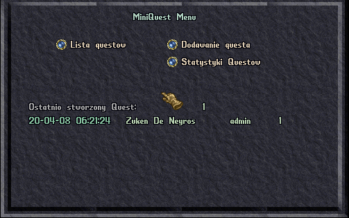

System miniquestów pozwala ekipie shardu na szybkie tworzenie małych questów, które umilą grę.

## Komendy

* **.mqt** - Otwiera główne menu systemu miniquestów
* **.mqn** - Użyty na NPCa, który bierze udział w miniqueście pokazuje informacje dotyczące questa
* **.mqp** - Użyty na graczu, pokazuje informacje dotyczące obecnego questa

### mqt
|Parametr|Opis|
|---|---|
|vars|Wyświetla informacje odnośnie specjalnych znaków do użycia w tekstach.|
|stat|Wyświetla informacje dotyczące statystyk wszystkich miniquestów.|

## Dodawanie questa

Aby dodać questa należy nacisnąć na guzik odpowiadający opcji 'Dodawanie questa'

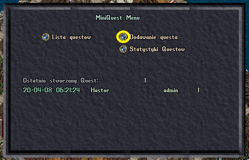

Przykładowe okno wypełnionego questa

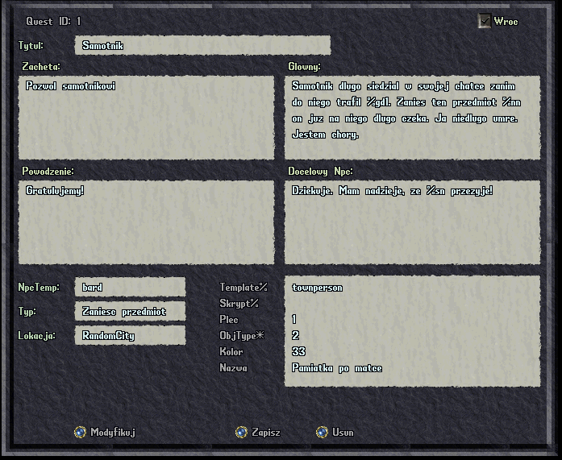

### Opis elementów gumpa

|Element|Opis
|---|---|
|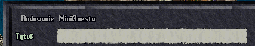|Tytuł questu.|
|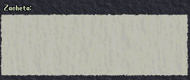|Tekst zachęty, który ukaże się graczowi przed wybraniem questa. Tekst może korzystać ze zmiennych, aby wygenerować prawidłowe koncówki. Przeczytaj o tym [tu](#zmienne).|
|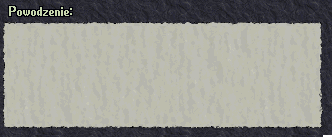|Tekst, który wyświetli się graczowi przy skutecznym wykonaniu questa. Tekst może korzystać ze zmiennych, aby wygenerować prawidłowe koncówki. Przeczytaj o tym [tu](#zmienne).|
|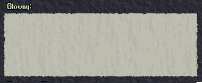|Główny tekst, który wyświetli się graczowi przed przystąpieniem do questa. Tekst może korzystać ze zmiennych, aby wygenerować prawidłowe koncówki. Przeczytaj o tym [tu](#zmienne).|
|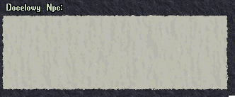|Tekst, który wyświeli się w kontakcie z docelowym NPC. Tekst może korzystać ze zmiennych, aby wygenerować prawidłowe koncówki. Przeczytaj o tym [tu](#zmienne).|
|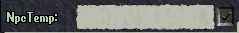|Template NPC'a, który będzie dawał quest.|
|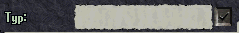|Typ questu. Sprawdź opis typu questów poniżej.|
||W jakich miejscach będzie można napotkać to zadanie.|
||Załadowuje informacje z instniejącego już questa.|
||Wyczyszcza wszystkie wpisane informacje z gumpów.|
||Sprawdza, czy wpisane dane mogą zostać zapisane.|
||Zapisuje wpisane dane jako szablon (na styl CTRL-C w Windowsie).
||Dodaje wpisane dane jako miniquest w systemie.

### Wartości do wpisania przy tworzeniu questa

|Nazwa|Opis|
|---|---|
||**0** - kobieta, **1** - mężczyzna - płeć NPC, który zostanie stworzony jako druga odnoga questa.|
||Nazwa przedmiotu, który zostanie stworzony do przekazania albo odebrania.|
||Kolor przedmiotu, który zostanie zdany do przekazania albo odebrania.|
||ObjType przedmiotu, który zostanie stworzony do przekazania albo odebrania. Sprawdź w itemdesc.cfg każdej paczki.|
|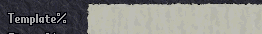|Template NPC, który zostanie stworzony jako druga odnoga questa.|
||Skrypt NPC, który zostanie stworzony jako druga odnoga questa. Można zostawić puste.|

### Typy questów

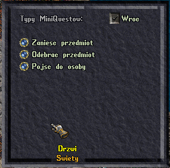

### Zmienne

Zmienne wykorzystujemy po to, aby wygenerować tekst, który będzie odmienialny. 

|Tekst wpisany w gump|Wynik w grze|
|---|---|
|**%pn**, proszę, jeśli mogl **%gp1**, zabierz ten **%in**. W **%loc** czekać na Ciebie będzie **%nn**. Je **%gd19%** rodzina coś o tym przedmiocie wie.|**Raziel**, proszę, jeśli mogl**bys**, zabierz ten **magiczny miecz**. W **Sakkath** czekać na Ciebie będzie **Sabrina - Mieszkanka Sakkath**. Je**j** rodzina coś o tym przedmiocie wie.

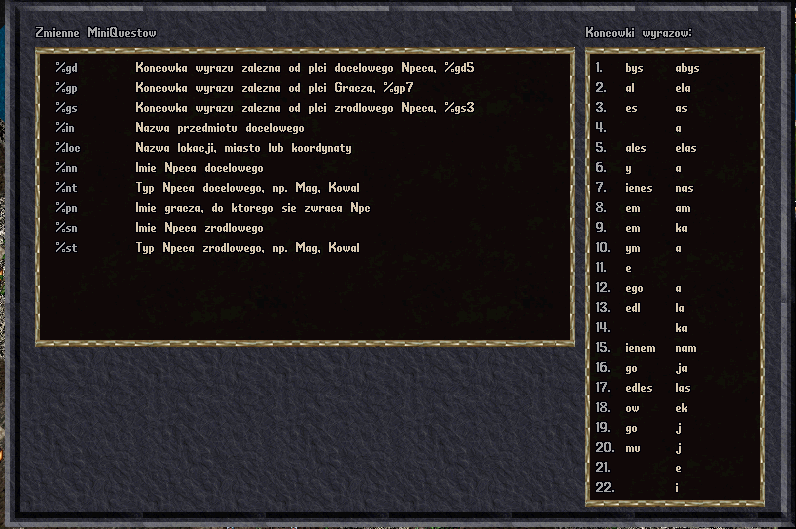

