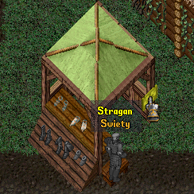
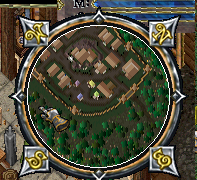
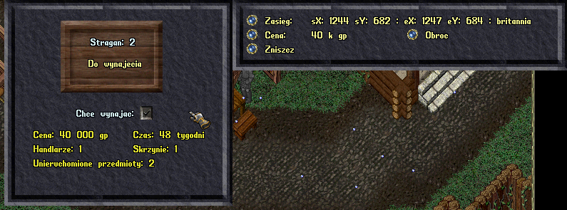
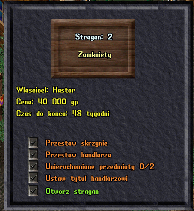

# System straganów

System straganów pozwala graczom na stawianie swoich kupców w miastach. System ten polega na ustawianiu specjalnych znaków **stragan**.

## Komendy

* **.mp add** - dodaje stragan
* **.mp del** - usuwa stragan

## Ustawianie straganu

Aby postawić stragan należy wykonać następujące czynności:

* .mp add
* Kliknąc w miejsce, w którym znak straganu ma się pojawić.
* Następnie, kierując się minimapą, przejśc do północno-zachodniego (NW) rogu straganu i nacisnąć OK.
* Następnie, kierująć sie minimapą, przejść do południowo-wschodniego (SE)rogu straganu i nacisnąć OK.

## Konfiguracja straganu

Standardowo, stragan otwarty jest na 48 tygodni (28 dni w czasie rzeczywistym).  

* **Cena** - zmienia cene za okres 48 tygodni. Cenę podajemy w tys.
* **Obroc** - obraca znak
* **Zasieg** - zmienia zasieg, dziala podobnie jak przy tworzeniu.
* **Zniszcz** - niszczy stragan

## Korzystanie jako gracz

Gracz, który chce wykorzystać stragan musi nacisnąć na guzik **_chce wynajac_**, jeśli posiada odpowiednią ilość pieniędzy - stragan zostanie wynajęty automatycznie.

* **Ustaw skrzynie** - ustawia bezpieczną skrzynie, w której można przechowywać przedmioty
* **Ustaw handlarza** - ustawia handlarza do straganu
* **Unieruchom przedmiot** - pozwala unieruchomić przedmiot na wystawę
* **Ustaw tytul handlarzowi** - pozwala na ustalenie unikalnego tytułu handlarzowi
* **Otworz stragan** - otwiera stragan do handlu
* **Zamknij stragan** zamyka stragan do handlu

